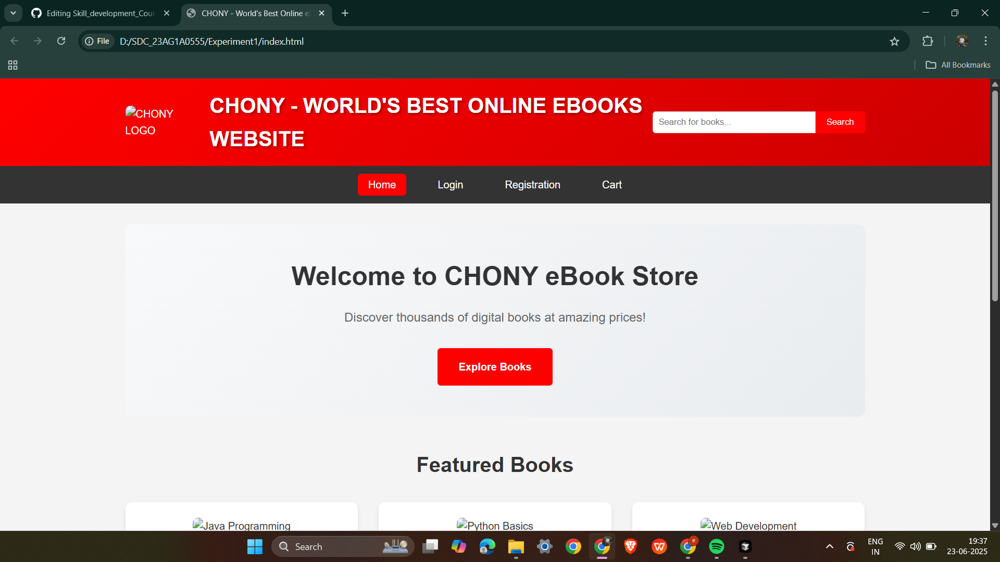
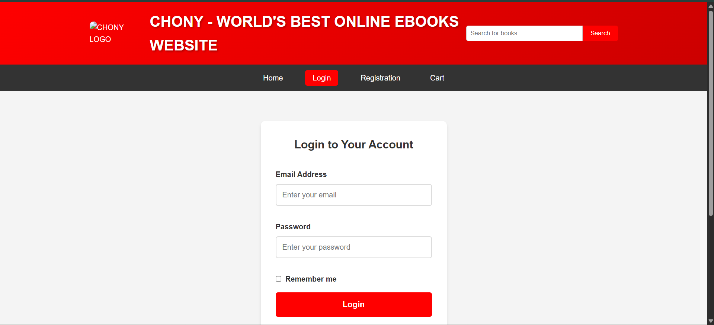
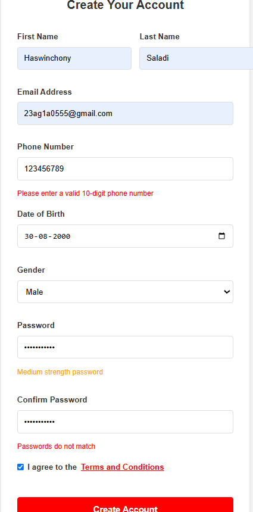
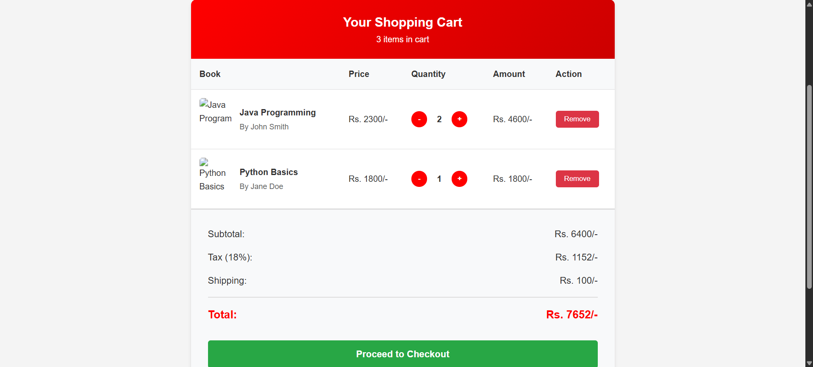

# Experiment 1: CHONY eBook Store

## Student Information
- **Name:** Haswinchony Saladi
- **Roll No:** 23AG1A0555
- **Email:** 23ag1a0555@gmail.com
- **Phone:** 7995921729

## Overview
This experiment creates a complete online eBook store website called "CHONY" with multiple pages including Home, Login, Registration, and Cart functionality.

## Features
- Responsive HTML structure
- CSS styling for modern look
- JavaScript for cart functionality
- Form validation
- Navigation between pages
- CHONY branding throughout

## File Structure
```
Experiment1/
├── index.html          # Home page
├── login.html          # Login page
├── registration.html   # Registration page
├── cart.html          # Shopping cart page
├── style.css          # Main stylesheet
└── README.md          # This file
```

## Technologies Used
- HTML5
- CSS3
- JavaScript
- Responsive Design

## How to Run
1. Open `index.html` in a web browser
2. Navigate through different pages using the navigation menu
3. Test the cart functionality
4. Try form validation on login and registration pages

## Output Screenshots

### Home Page

*CHONY eBook Store Home Page with featured books and categories*

### Login Page

*User login form with validation*

### Registration Page

*User registration form with comprehensive validation*

### Cart Page

*Shopping cart with item management and checkout*

## Key Learning Objectives
- HTML structure and semantics
- CSS styling and layout
- JavaScript DOM manipulation
- Form handling and validation
- Responsive web design principles
- Branding and user experience design

## Features Demonstrated
- ✅ Responsive navigation menu
- ✅ Modern card-based book display
- ✅ Form validation with error messages
- ✅ Shopping cart functionality
- ✅ Professional styling with CHONY branding
- ✅ Cross-page navigation
- ✅ User-friendly interface design 